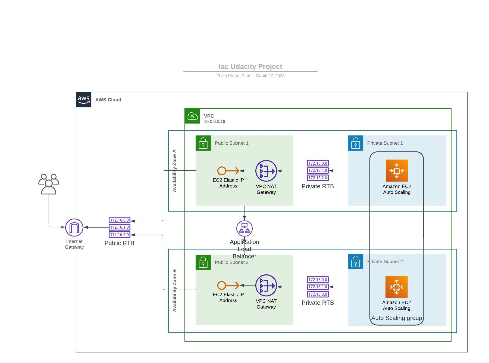
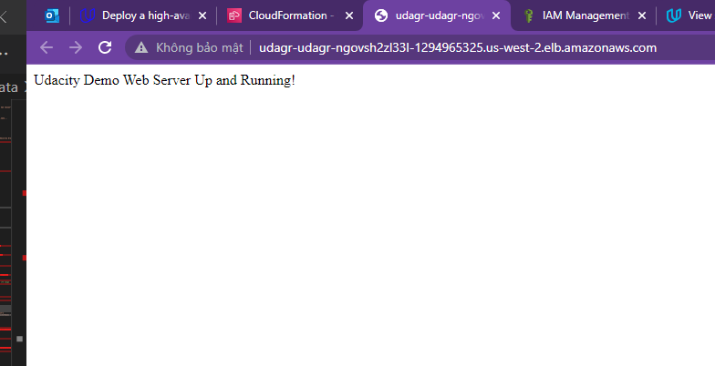
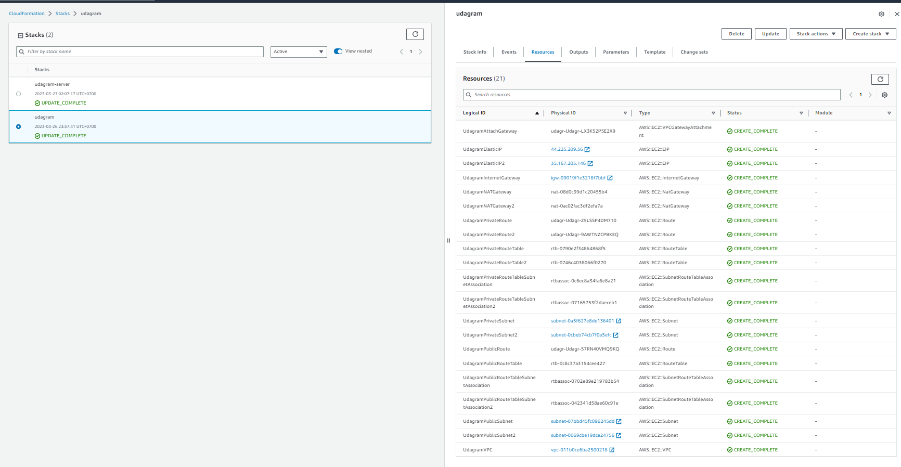
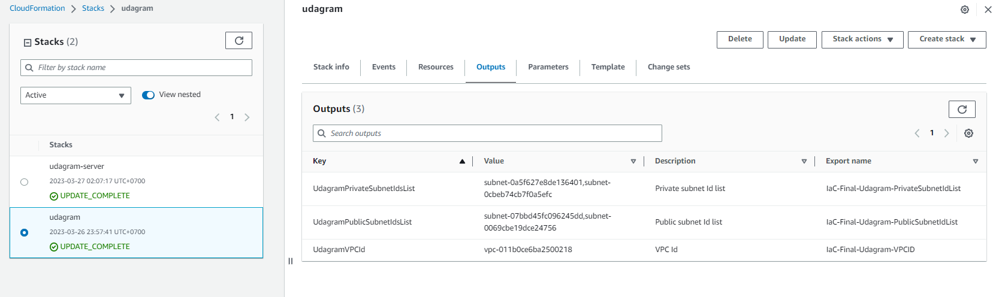
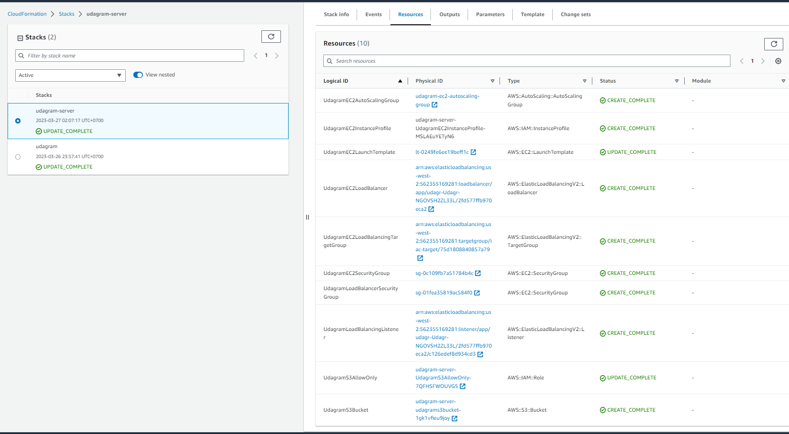
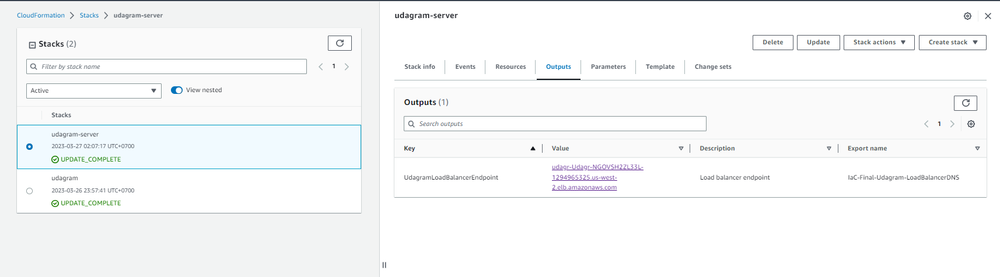

# udacity-cde-iac
Project deploy a high-availability web app using CloudFormation

## Project Diagram
[Link Lucid Chart](https://lucid.app/lucidchart/7cd47ef7-27ef-4800-ae1b-763d8623e8dd/edit?view_items=85_IWcqQHgn3%2C85_I2Qr47M4r%2C85_Iguw9nAqm%2CNaaJdQ-.e2XA%2C85_IWDcyOMgG%2C_maJ2GFifBIz%2C85_I466~EIVX%2CItaJ.ExFDCOR%2CdsaJkZ3GauXD%2C85_Iq3EJHr1d%2COaaJKzOO.hxO%2C85_Ie8hXpfWu%2CdE~I73WTMKBc%2C85_IlkI8pWLe%2C3D~I04fk~E3Q%2CjM~I8prajrKh%2CjcaJ~cFPSLBk%2C85_Ib2r1Iy_S%2CxcaJDTHskHVe%2CxoaJKQf8dBvP%2CTvaJ6UqK3C1S%2CpcaJI5dldoc_%2C5taJ1_SmNJxQ%2CxsaJXZSqYJcG%2CtoaJ7f6iL8pT%2CscaJX6mkVTW9%2CWvaJh9PTEen_%2CzoaJU9SxlwbW%2CAcaJrYAgQ.3T%2C85_IfjfnCvWP%2C85_Ik_L0uI91%2C85_Ivs8.PmlK&invitationId=inv_c70c3523-69b1-4874-af30-1f0f027715aa)


## How to run
1. Create network:
```
./create.sh udagram-network ./network/config.yml ./network/params.json
```
2. Create server:
```
./create.sh udagram-server ./server/config.yml ./server/params.json
```
**Notes**: You can change udagram to other name. 

## Result
[Link Load Balancer](http://udagr-udagr-ngovsh2zl33l-1294965325.us-west-2.elb.amazonaws.com/)

### Final Result

### Network Resources

### Network Outputs

### Server Resources

### Server Outputs
